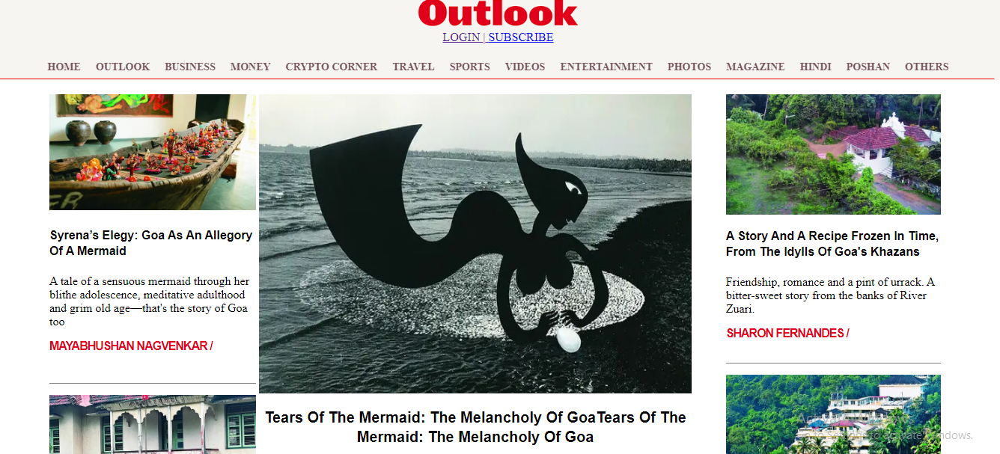
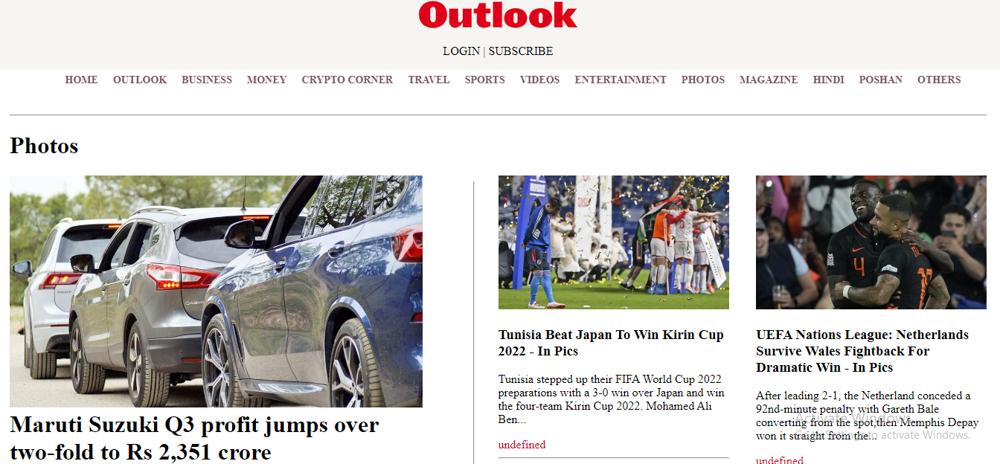
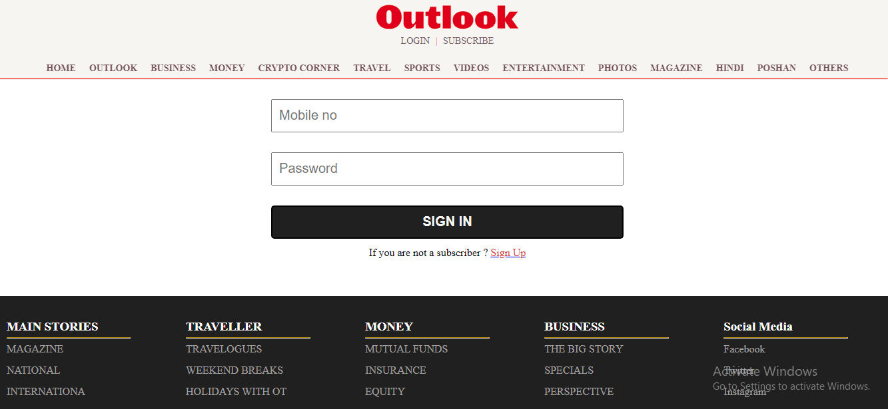

# DemoOutlook

Its a news website that shows the latest  news in the catagorised part with login and subscribe .

• Outlook is a daily News website that provides
  national and International news
  
• This was a collaboration project of 4 member

• Features: Homepage, Login/Signup, Dashboard

• Tech-Stack: React, JavaScript, ChakraUi , CSS

• Areas of responsibility: fetch news for photos page
  and show to ui and manage photos page
  
  
Live link : - https://loquacious-kheer-13bb24.netlify.app/index.html

<h2>Here are some screenshots of the clone website</h2>

<h2> Outlook Page :- </h2>

<h2> Photos Page :- </h2>

<h2> Login Page :- </h2>

